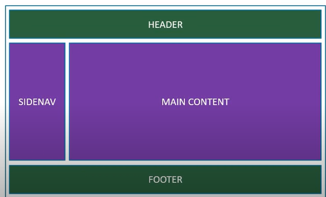

# React Course

## What is React?

> Open source library for building user interfaces.  
> It's a library and not a frame work.  
> It focuses on doing one thing and one thing really well that is building user Interfaces  
> Rich eco system
> Recact is declarative: we just tell react what we want to have in UI and react with it's dom api will build th UI

---

### Component Based architecture

---

> component" is the building block of user interfaces  
> component is Reusable piece of code that encapsulates a specific functionality or part of the UI.  
> Components can be thought of as custom HTML elements, and they can be composed together to create complex UIs.
